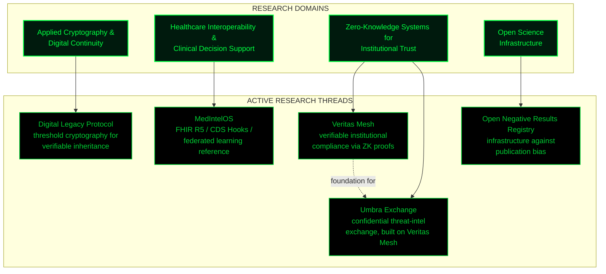

# Research Manifesto

**Ciprian Stefan Plesca** — Independent Researcher, Piatra Neamț, Romania
ORCID: [0009-0006-1340-0232](https://orcid.org/0009-0006-1340-0232)

---

## Preamble

This document states, in full, what my research program is, why it takes the shape it does, and what standard of evidence I hold it to. It is written to be read by two audiences at once: an engineer evaluating whether the underlying systems are sound, and an academic reader evaluating whether the underlying claims are careful. Both readers deserve the same document — I have not written two versions of this.

I am an **independent researcher**, working outside a university or corporate research laboratory. That is a statement of fact, not a hedge and not a boast. It means there is no institutional review process standing between a claim I make and the public record of it — which is precisely why the standard I hold myself to has to be stricter, not looser, than an affiliated researcher's, and why every claim in this document and in the repositories it describes is written to be checked, not taken on trust.

## Why this program exists

Three observations motivate the work described here.

**First**, systems that are supposed to be trusted — financial infrastructure, clinical decision support, the mechanisms by which a person's digital assets pass to their heirs — are frequently built with the trust *assumed* rather than *demonstrated*. A claim of "zero-trust" or "verifiable" architecture is common in marketing copy and rare in a form a third party can actually check. This program treats verifiability as a property that has to be built in, not asserted after the fact.

**Second**, the domains this program touches — applied cryptography, clinical interoperability, threat-intelligence sharing — each have an existing body of standards and prior work (FHIR, CDS Hooks, Shamir's Secret Sharing, Groth16, MISP, and others catalogued in `BIBLIOGRAPHY.md`). Good research in these areas means situating new work against that existing body precisely, not reinventing primitives without citing what already exists, and not overstating novelty where the actual contribution is integration or application rather than a new primitive.

**Third**, most public technical writing — including a great deal of my own earlier work — optimizes for how impressive a system sounds rather than for how precisely a reader can evaluate it. This program is a deliberate correction of that: every project states its maturity level, its scope boundary, and what it explicitly does not do, because a reader's ability to falsify a claim is what makes the claim worth making at all.

## Research program map

Each node in the lower layer is a repository with its own README, scope table, and — where applicable — architecture and decision-record documentation. This diagram exists to show how the threads relate; it is not a substitute for reading the individual project documentation, and it will be revised as the threads themselves evolve, not left to quietly go stale.

## Methodology

Every project in this program moves through the same sequence, regardless of domain. This is the actual research method, stated once here instead of re-explained in each repository.

```mermaid
flowchart LR
    Q["Research question /<br/>problem statement"] --> LIT["Literature & prior-art review<br/>(see BIBLIOGRAPHY.md)"]
    LIT --> SCOPE["Explicit scope definition —<br/>what this will and will<br/>NOT attempt to solve"]
    SCOPE --> SPEC["Formal or semi-formal spec<br/>(state machines, threat models,<br/>TLA+ where applicable)"]
    SPEC --> IMPL["Implementation"]
    IMPL --> TEST["Testing against the spec —<br/>numbers reported are numbers<br/>checked in CI"]
    TEST --> DOC["Maturity-labeled documentation<br/>(prototype / alpha / production)"]
    DOC --> REVIEW["Public exposure for review —<br/>issues, audits, citation"]
    REVIEW -.feedback.-> SCOPE

    classDef step fill:#000000,stroke:#00FF41,color:#00FF41,stroke-width:1.5px
    class Q,LIT,SCOPE,SPEC,IMPL,TEST,DOC,REVIEW step
```

The loop from **Review** back to **Scope** is deliberate: public exposure — an issue report, a citation that surfaces a gap, an audit finding — is treated as new input to the scope definition, not as a threat to defend the original claims against. A scope table that never changes in response to outside scrutiny is a sign the scrutiny isn't being taken seriously.

## Epistemic principles

These are restated, more formally, from `MANIFESTO.md`, because a research manifesto and an engineering manifesto are read by different audiences but should not say different things.

1. **Every claim is falsifiable or it is not made.** A statement like "this circuit is compliant" without a stated compliance target, or "this reduces publication bias" without a mechanism for measuring that reduction, is not a research claim — it is an aspiration, and this program labels aspirations as such.

2. **Citation is not decoration.** Where this program builds on prior work — Shamir (1979) for threshold secret sharing, Groth (2016) for the proof system, the HL7 FHIR R5 and CDS Hooks specifications, McMahan et al. (2017) for federated averaging — that work is cited precisely, in `BIBLIOGRAPHY.md`, with an explicit note on where the implementation matches the cited guarantee and where it does not yet.

3. **Independence is disclosed, not hidden or overstated.** This program is not peer-reviewed in the formal academic sense. It has not passed through institutional ethics review, grant review, or departmental oversight. Framing it as equivalent to peer-reviewed research would be dishonest; framing it as therefore worthless would be equally dishonest. It is independent, published, open to scrutiny, and its claims stand or fall on whether a reader can verify them — which is the actual standard this document asks to be held to.

4. **A negative result is a result.** The `Open Negative Results Registry` thread exists because the alternative — treating null findings as failures not worth publishing — actively damages the reliability of the biomedical literature this program's own healthcare-interoperability work depends on. Consistency requires holding this program's own null or partial results to the same standard.

5. **Solo work means no second reviewer catches what I miss.** This is stated in `MANIFESTO.md` and repeated here because it bears directly on how this document should be read: as an invitation to find the gaps, not as a finished case.

## On the "independent researcher" designation

I want to be precise about what this label does and does not claim. It does not claim a formal academic appointment, a PhD, or institutional funding — I hold none of these, and stating otherwise would violate the first principle above. It does claim:

- A sustained, documented body of technical work, publicly available and versioned (see the tagged releases and citation records across the repositories in this program).
- A registered [ORCID iD](https://orcid.org/0009-0006-1340-0232), the standard mechanism by which independent and affiliated researchers alike are identified across the scholarly record.
- Adherence to the citation, falsifiability, and scope-disclosure norms described above, applied consistently rather than selectively.

Independent research has a long history of legitimate contribution precisely where it is transparent about its own position — and a long history of illegitimate contribution precisely where it borrows the *appearance* of institutional authority without the underlying practice. This document exists to place this program clearly in the former category, and to make it easy for a skeptical reader to check that placement rather than take it on faith.

## What this helps, concretely

Stated plainly, without the abstraction of the sections above:

- **Digital Legacy Protocol** addresses a real, underserved problem: existing digital-inheritance mechanisms typically require trusting a single custodian (a company, an exchange, a lawyer holding a password) with irreversible power over an estate. A threshold-cryptography approach removes that single point of failure and single point of coercion.
- **MedIntelOS** provides a reference implementation that lets researchers and small institutions experiment with FHIR-based interoperability and federated learning without either building the scaffolding from scratch or trusting a closed commercial platform's internals.
- **Veritas Mesh and Umbra Exchange** target a gap in institutional trust infrastructure: proving compliance or sharing threat intelligence currently tends to require exposing the underlying sensitive data to a counterparty; zero-knowledge proofs make it possible to prove the *fact* of compliance or observation without that exposure.
- **Open Negative Results Registry** targets publication bias directly, by making it structurally easier to publish a null result than to let it disappear into a file drawer.

Each of these is a real, bounded contribution — not a claim to have solved the domain, and the scope tables in each repository say so explicitly.

## Closing statement

This manifesto will be revised as the program changes; see `CHANGELOG.md` for when and why. It is not a founding document meant to be read once and archived — it is a working statement of method, and it is only as honest as its last update. If a claim here stops matching the repositories it describes, that is a defect to report, not a nuance to overlook.

---

*Correspondence, corrections, and citations: via the contact channels listed in the profile README, or by opening an issue on the relevant repository.*
