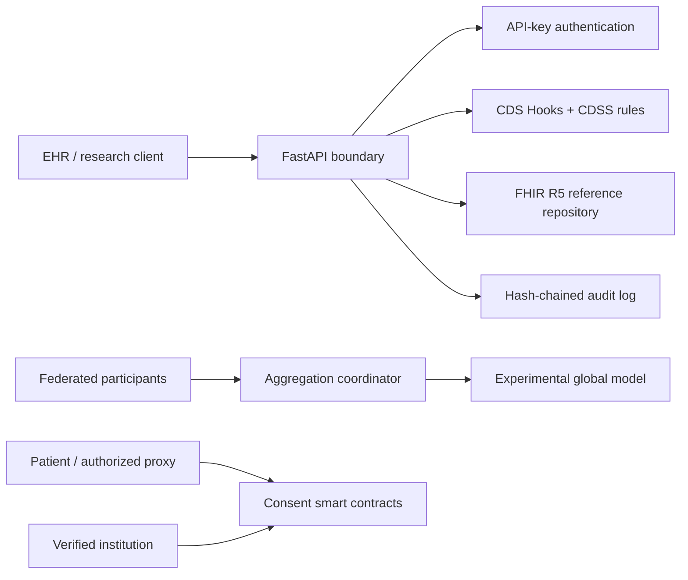

# MedIntelOS

[](https://github.com/Ciprian-LocalPulse/MedIntelOS/actions/workflows/ci.yml)
[](LICENSE)
[](pyproject.toml)
[](https://hl7.org/fhir/R5/)

MedIntelOS is an open-source reference implementation for experimenting with
health-data interoperability, clinical decision-support workflows, federated
model aggregation, tamper-evident audit records, and patient-consent contracts.

The repository is intentionally honest about its maturity: it is an **alpha,
educational system**, not a production EHR, not a complete FHIR implementation,
not a medical device, and not evidence of regulatory compliance.


<div align="center">
  
</div>


> **Concept illustration:** The labels and interfaces shown above communicate the
> long-term product vision. They do not represent implemented functionality,
> clinical validation, security certification, or regulatory compliance.

## Implemented Scope

| Area | Included | Important boundary |
|---|---|---|
| FHIR R5 | JSON builders, in-memory CRUD, search subset, version IDs, ETags, CapabilityStatement | Not a conformance-tested or persistent FHIR server |
| CDS Hooks | Discovery and `patient-view` service endpoint | Uses a project-specific prefetch context; rules are not clinically validated |
| CDSS | qSOFA, NEWS2, AKI rule, CHA2DS2-VASc helper, threshold and medication examples | Educational rules only; drug knowledge base is deliberately small |
| Federated learning | Weighted aggregation, callback-based participant updates, DP noise experiment, outlier detection | No cryptographic secure aggregation or formal privacy accountant |
| Audit | In-memory SHA-256 hash chain | Tamper-evident in one process, not durable or independently anchored |
| Consent | Solidity consent and audit contracts plus Hardhat tests | Identity, legal authority, erasure, governance, and key custody remain off-chain |
| Operations | Docker, Compose, CI, linting, tests, API docs | Production infrastructure is outside this repository |

## Architecture



See [Architecture](docs/ARCHITECTURE.md), [Threat Model](docs/THREAT_MODEL.md),
and [Deployment Guide](docs/DEPLOYMENT.md) for the technical detail.

## Repository Layout

```text
src/medintelos/
  api/                 FastAPI routes and request validation
  fhir/                FHIR builders, parsers, and in-memory repository
  cdss.py              Clinical scoring and alert examples
  federated.py         Federated aggregation coordinator
  audit.py             Tamper-evident audit chain
  security.py          API authentication boundary
contracts/             Solidity consent and audit contracts
contract-tests/        Hardhat contract tests
tests/                 Python unit and API tests
docs/                  Architecture, threat model, and deployment notes
examples/              Synthetic requests only
```

## Quick Start

### Python

```bash
python -m venv .venv
# Windows: .venv\Scripts\activate
# Linux/macOS: source .venv/bin/activate
python -m pip install -e ".[dev]"
$env:MEDINTELOS_API_KEY="local-development-key-change-me"
uvicorn medintelos.api.app:app --reload --port 8080
```

On Linux or macOS, use `export MEDINTELOS_API_KEY=...` instead.

Open:

- Swagger UI: `http://localhost:8080/docs`
- ReDoc: `http://localhost:8080/redoc`
- Health: `http://localhost:8080/health`
- FHIR metadata: `http://localhost:8080/fhir/R5/metadata`

### Docker

```bash
cp .env.example .env
# Set a new MEDINTELOS_API_KEY in .env
docker compose up --build
```

## API Examples

Create a synthetic FHIR Patient:

```bash
curl -X POST http://localhost:8080/fhir/R5/Patient \
  -H "Content-Type: application/fhir+json" \
  -H "X-API-Key: local-development-key-change-me" \
  --data @examples/fhir-patient.json
```

Evaluate a synthetic patient context:

```bash
curl -X POST http://localhost:8080/api/v1/cdss/evaluate \
  -H "Content-Type: application/json" \
  -H "X-API-Key: local-development-key-change-me" \
  --data @examples/cdss-request.json
```

The result is shaped as CDS Hooks cards plus a namespaced `_medintelos` section
containing rule details. Optional fields are omitted where the integration path
requires stricter CDS Hooks conformance.

## Federated Learning Example

The coordinator accepts an application-provided update callback. Network
transport, participant authentication, signatures, model serialization, secure
aggregation, and privacy accounting must be supplied by the deployment.

```python
import numpy as np

from medintelos.federated import (
    DifferentialPrivacyConfig,
    FederatedCoordinator,
    ModelUpdate,
)

def update_provider(participant, round_id, global_model):
    return ModelUpdate(
        participant_id=participant.participant_id,
        round_id=round_id,
        weights={"weight": np.array([1.0, 2.0])},
        num_samples=100,
        loss=0.25,
    )

coordinator = FederatedCoordinator(
    model_type="synthetic-demo",
    privacy=DifferentialPrivacyConfig(enabled=False),
    min_participants=2,
    total_rounds=1,
    update_provider=update_provider,
)
```

## Smart Contracts

```bash
npm install
npm test
```

The deployment sequence is:

1. Deploy `MedIntelOSAuditLedger` with the zero address.
2. Deploy `MedIntelOSConsentManager` with the ledger address.
3. Call `setConsentManager` on the ledger.
4. Register and independently verify institution identities.

Never put PHI, names, identifiers, clinical notes, or raw FHIR resources on a
public blockchain. Even hashes can create linkage and retention risks.

## Quality Checks

```bash
ruff check .
pytest
mypy src/medintelos
```

The GitHub Actions workflow runs Python linting and tests. Contract tests run in
a separate CI job.

## Security and Privacy

- The demo API uses a static API key so the authentication boundary is visible.
- Production deployments need OIDC/OAuth 2.0, short-lived credentials, scopes,
  tenant isolation, KMS-backed secrets, TLS, rate limits, and durable audit data.
- The in-memory FHIR store loses all data at process exit and must never hold PHI.
- Logs avoid request bodies, but operators must validate the entire observability path.
- Report vulnerabilities according to [SECURITY.md](SECURITY.md).

## Standards Position

- FHIR Release 5 is published as version 5.0.0 by HL7.
- The project follows the CDS Hooks discovery and service interaction shape.
- It does not claim SMART App Launch support, profile validation, terminology
  validation, Bulk Data, subscriptions, XML support, or FHIR certification.

Primary references:

- [HL7 FHIR R5](https://hl7.org/fhir/R5/)
- [CDS Hooks stable specifications](https://cds-hooks.hl7.org/)
- [SMART App Launch](https://hl7.org/fhir/smart-app-launch/)
- [HHS HIPAA Security Rule summary](https://www.hhs.gov/hipaa/for-professionals/security/laws-regulations/)

## Contributing

Read [CONTRIBUTING.md](CONTRIBUTING.md). Clinical behavior changes require a
published source, explicit assumptions, boundary tests, and a reviewer who can
assess the clinical and human-factors impact.
## 💖 Support & Donations

MedIntelOS is free and open-source forever. If this project helps your hospital, clinic, or research institution, please consider supporting continued development:

### 💳 PayPal
**[paypal.me/agentflowenterprise](https://paypal.me/agentflowenterprise)**

### 🏦 Bank Transfer (EUR / SEPA)
| Field | Value |
|---|---|
| Name | Ciprian Stefan Plesca |
| IBAN | BE83 9679 1975 8915 |
| BIC/SWIFT | TRWIBEB1XXX |
| Bank | Wise, Rue du Trône 100, Brussels, Belgium |

### 🏦 Bank Transfer (GBP)
| Field | Value |
|---|---|
| Name | Ciprian Stefan Plesca |
| Account Number | 92055372 |
| Sort Code | 23-14-70 |
| IBAN | GB68 TRWI 2314 7092 0553 72 |
| BIC/SWIFT | TRWIGB2LXXX |

### 🏦 Bank Transfer (USD)
| Field | Value |
|---|---|
| Name | Ciprian Stefan Plesca |
| Account Type | Checking |
| Routing Number | 026073150 |
| Account Number | 8314225367 |
| BIC/SWIFT | CMFGUS33 |
| Bank | Community Federal Savings Bank, 89-16 Jamaica Ave, Woodhaven, NY 11421, USA |

### ₿ Cryptocurrency
| Currency | Address |
|---|---|
| **Bitcoin (BTC)** | `bc1qf3yy0w8z37rwavxpu38wem3yffpanw7wzj32qj` |
| **Ethereum (ETH)** | `0x27d9a6a5b8507e6031bb044319410da96222d402` |

Every contribution — no matter how small — directly funds:
- New AI model development and clinical validation
- Security audits and penetration testing
- Documentation and clinical training materials
- Hospital pilot deployments in underserved regions

---

## License

Code is available under the [MIT License](LICENSE). The license does not remove
the medical, legal, privacy, security, or regulatory responsibilities described
in [MEDICAL_DISCLAIMER.md](MEDICAL_DISCLAIMER.md).
