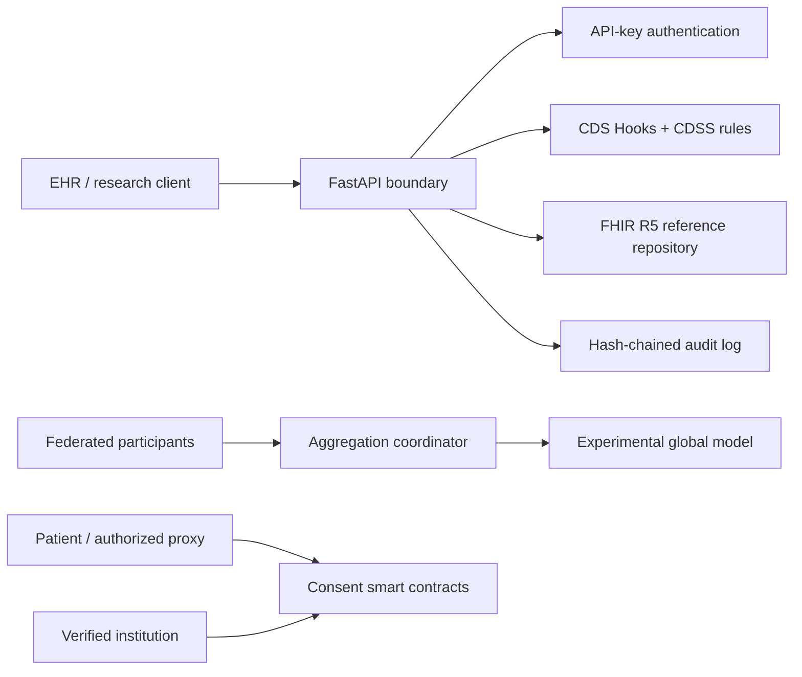
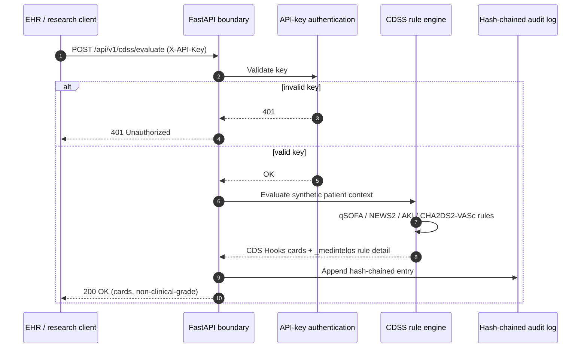
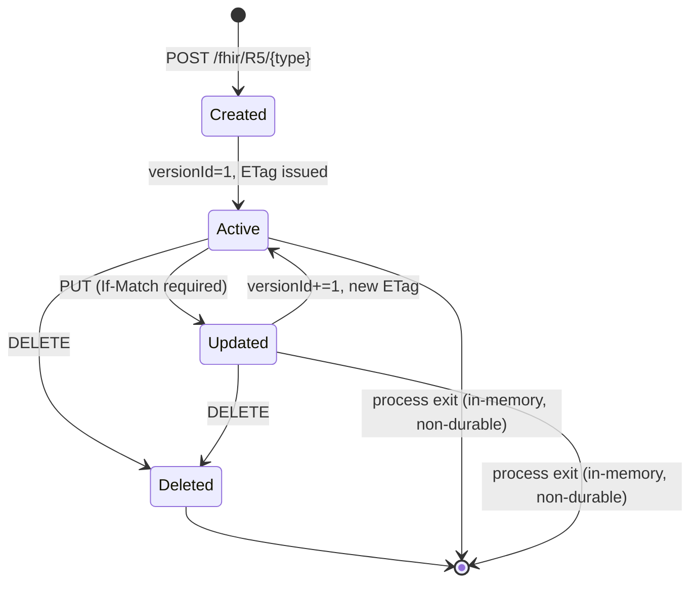
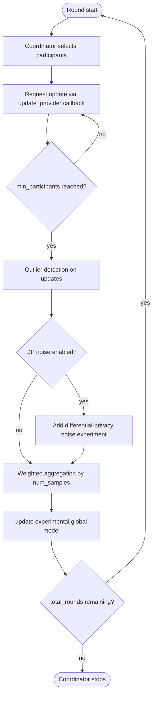
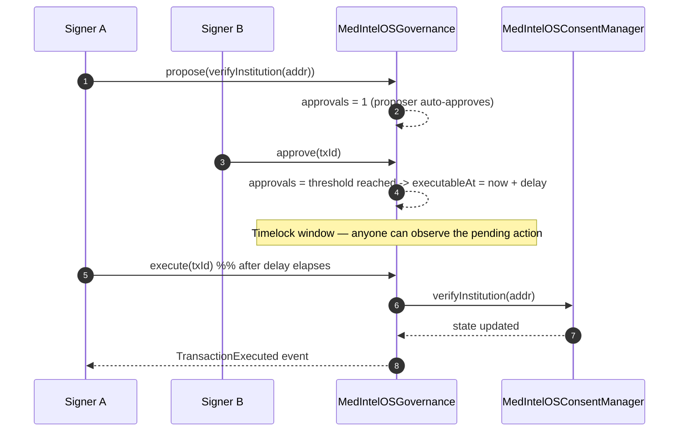

# MedIntelOS

[](https://github.com/Ciprian-LocalPulse/MedIntelOS/actions/workflows/ci.yml)
[](LICENSE)
[](pyproject.toml)
[](https://hl7.org/fhir/R5/)

MedIntelOS is an open-source reference implementation for experimenting with
health-data interoperability, clinical decision-support workflows, federated
model aggregation, tamper-evident audit records, and patient-consent contracts.

The repository is intentionally honest about its maturity: it is an **alpha,
educational system**, not a production EHR, not a complete FHIR implementation,
not a medical device, and not evidence of regulatory compliance.

## Project Stage

Current release: **`v0.1.0-alpha`**, with milestone **0.2.0 (governance & CI
hardening)** merged to `main` and milestone **0.8.0 (consent contract
governance)** partially complete. Status pulled directly from
[docs/ROADMAP.md](docs/ROADMAP.md) and [CHANGELOG.md](CHANGELOG.md), not
aspirational:


```mermaid
gantt
    title MedIntelOS maturity roadmap (docs/ROADMAP.md)
    dateFormat  X
    axisFormat  %s
    section Done
    0.1.0 Alpha (tagged)                 :done, m1, 0, 1
    0.2.0 Governance & CI hardening      :done, m2, 1, 2
    section In progress
    0.8.0 Consent contract governance    :active, m8, 2, 3
    section Not started
    0.3.0 Persistent FHIR store          :m3, 3, 4
    0.4.0 Production-grade auth          :m4, 4, 5
    0.5.0 FHIR interoperability depth    :m5, 5, 6
    0.6.0 CDSS evidence & conformance    :m6, 6, 7
    0.7.0 Federated learning hardening   :m7, 7, 8
    0.9.0 Observability & operations     :m9, 8, 9
```

Milestone 0.8.0 detail, since it's the one most recently worked on:

| Item | Status |
|---|---|
| Multisig + timelock for admin functions | **Done** — `contracts/MedIntelOSGovernance.sol`, wired via `transferOwnership` on both consent/audit contracts |
| DID/VC identity-to-consent design | **Documented, not implemented** — [docs/DID_VC_DESIGN.md](docs/DID_VC_DESIGN.md) |
| External audit of consent + audit + governance contracts | **Not started** — requires an independent third-party auditor; see [docs/CONTRACT_AUDIT_CHECKLIST.md](docs/CONTRACT_AUDIT_CHECKLIST.md) |

No milestone here claims clinical validation, regulatory clearance, or a
completed security audit — those require processes and evidence outside what
a repository change can produce, and `docs/VALIDATION.md` / `docs/THREAT_MODEL.md`
say so explicitly.


> **Concept illustration:** The labels and interfaces shown above communicate the
> long-term product vision. They do not represent implemented functionality,
> clinical validation, security certification, or regulatory compliance.

## Implemented Scope

| Area | Included | Important boundary |
|---|---|---|
| FHIR R5 | JSON builders, in-memory CRUD, search subset, version IDs, ETags, CapabilityStatement | Not a conformance-tested or persistent FHIR server |
| CDS Hooks | Discovery and `patient-view` service endpoint | Uses a project-specific prefetch context; rules are not clinically validated |
| CDSS | qSOFA, NEWS2, AKI rule, CHA2DS2-VASc helper, threshold and medication examples | Educational rules only; drug knowledge base is deliberately small |
| Federated learning | Weighted aggregation, callback-based participant updates, DP noise experiment, outlier detection | No cryptographic secure aggregation or formal privacy accountant |
| Audit | In-memory SHA-256 hash chain | Tamper-evident in one process, not durable or independently anchored |
| Consent | Solidity consent and audit contracts, a multisig+timelock governance contract, plus Hardhat tests | Identity, legal authority, erasure, and key custody remain off-chain; not externally audited |
| Operations | Docker, Compose, CI, linting, tests, API docs | Production infrastructure is outside this repository |

## Architecture


```mermaid
flowchart LR
    Client["EHR / research client"] --> API["FastAPI boundary"]
    API --> Auth["API-key authentication"]
    API --> CDS["CDS Hooks + CDSS rules"]
    API --> FHIR["FHIR R5 reference repository"]
    API --> Audit["Hash-chained audit log"]
    Sites["Federated participants"] --> FL["Aggregation coordinator"]
    FL --> Model["Experimental global model"]
    Patient["Patient / authorized proxy"] --> Contract["Consent smart contracts"]
    Institution["Verified institution"] --> Contract
```

See [Architecture](docs/ARCHITECTURE.md), [Threat Model](docs/THREAT_MODEL.md),
and [Deployment Guide](docs/DEPLOYMENT.md) for the technical detail.

### CDS Hooks request lifecycle


```mermaid
sequenceDiagram
    autonumber
    participant EHR as EHR / research client
    participant API as FastAPI boundary
    participant Auth as API-key authentication
    participant CDS as CDSS rule engine
    participant Audit as Hash-chained audit log

    EHR->>API: POST /api/v1/cdss/evaluate (X-API-Key)
    API->>Auth: Validate key
    alt invalid key
        Auth-->>API: 401
        API-->>EHR: 401 Unauthorized
    else valid key
        Auth-->>API: OK
        API->>CDS: Evaluate synthetic patient context
        CDS->>CDS: qSOFA / NEWS2 / AKI / CHA2DS2-VASc rules
        CDS-->>API: CDS Hooks cards + _medintelos rule detail
        API->>Audit: Append hash-chained entry
        API-->>EHR: 200 OK (cards, non-clinical-grade)
    end
```

### FHIR resource lifecycle (in-memory reference store)


```mermaid
stateDiagram-v2
    [*] --> Created: POST /fhir/R5/{type}
    Created --> Active: versionId=1, ETag issued
    Active --> Updated: PUT (If-Match required)
    Updated --> Active: versionId+=1, new ETag
    Active --> Deleted: DELETE
    Updated --> Deleted: DELETE
    Deleted --> [*]
    Active --> [*]: process exit (in-memory, non-durable)
    Updated --> [*]: process exit (in-memory, non-durable)
```

### Federated learning round


```mermaid
flowchart TD
    Start([Round start]) --> Select[Coordinator selects participants]
    Select --> Req[Request update via update_provider callback]
    Req --> Collect{"min_participants reached?"}
    Collect -- no --> Req
    Collect -- yes --> Outlier[Outlier detection on updates]
    Outlier --> DP{"DP noise enabled?"}
    DP -- yes --> Noise[Add differential-privacy noise experiment]
    DP -- no --> Agg
    Noise --> Agg[Weighted aggregation by num_samples]
    Agg --> Model[Update experimental global model]
    Model --> More{"total_rounds remaining?"}
    More -- yes --> Start
    More -- no --> End([Coordinator stops])
```

### Consent governance: multisig + timelock


```mermaid
sequenceDiagram
    autonumber
    participant S1 as Signer A
    participant S2 as Signer B
    participant Gov as MedIntelOSGovernance
    participant CM as MedIntelOSConsentManager

    S1->>Gov: propose(verifyInstitution(addr))
    Gov-->>Gov: approvals = 1 (proposer auto-approves)
    S2->>Gov: approve(txId)
    Gov-->>Gov: approvals = threshold reached -> executableAt = now + delay
    Note over Gov: Timelock window — anyone can observe the pending action
    S1->>Gov: execute(txId)  %% after delay elapses
    Gov->>CM: verifyInstitution(addr)
    CM-->>Gov: state updated
    Gov-->>S1: TransactionExecuted event
```

See [docs/DID_VC_DESIGN.md](docs/DID_VC_DESIGN.md) for how off-chain identity
(DIDs/Verifiable Credentials) is designed to link to wallet addresses without
ever touching the chain, and [docs/DEPLOYMENT.md](docs/DEPLOYMENT.md) for the
full governance deployment sequence.

## Repository Layout

```text
src/medintelos/
  api/                 FastAPI routes and request validation
  fhir/                FHIR builders, parsers, and in-memory repository
  cdss.py              Clinical scoring and alert examples
  federated.py         Federated aggregation coordinator
  audit.py             Tamper-evident audit chain
  security.py          API authentication boundary
contracts/             Solidity consent, audit, and governance contracts
contract-tests/        Hardhat contract tests (consent + governance)
tests/                 Python unit and API tests
docs/                  Architecture, threat model, deployment, DID/VC design
examples/              Synthetic requests only
```

## Quick Start

### Python

```bash
python -m venv .venv
# Windows: .venv\Scripts\activate
# Linux/macOS: source .venv/bin/activate
python -m pip install -e ".[dev]"
$env:MEDINTELOS_API_KEY="local-development-key-change-me"
uvicorn medintelos.api.app:app --reload --port 8080
```

On Linux or macOS, use `export MEDINTELOS_API_KEY=...` instead.

Open:

- Swagger UI: `http://localhost:8080/docs`
- ReDoc: `http://localhost:8080/redoc`
- Health: `http://localhost:8080/health`
- FHIR metadata: `http://localhost:8080/fhir/R5/metadata`

### Docker

```bash
cp .env.example .env
# Set a new MEDINTELOS_API_KEY in .env
docker compose up --build
```

## API Examples

Create a synthetic FHIR Patient:

```bash
curl -X POST http://localhost:8080/fhir/R5/Patient \
  -H "Content-Type: application/fhir+json" \
  -H "X-API-Key: local-development-key-change-me" \
  --data @examples/fhir-patient.json
```

Evaluate a synthetic patient context:

```bash
curl -X POST http://localhost:8080/api/v1/cdss/evaluate \
  -H "Content-Type: application/json" \
  -H "X-API-Key: local-development-key-change-me" \
  --data @examples/cdss-request.json
```

The result is shaped as CDS Hooks cards plus a namespaced `_medintelos` section
containing rule details. Optional fields are omitted where the integration path
requires stricter CDS Hooks conformance.

## Federated Learning Example

The coordinator accepts an application-provided update callback. Network
transport, participant authentication, signatures, model serialization, secure
aggregation, and privacy accounting must be supplied by the deployment.

```python
import numpy as np

from medintelos.federated import (
    DifferentialPrivacyConfig,
    FederatedCoordinator,
    ModelUpdate,
)

def update_provider(participant, round_id, global_model):
    return ModelUpdate(
        participant_id=participant.participant_id,
        round_id=round_id,
        weights={"weight": np.array([1.0, 2.0])},
        num_samples=100,
        loss=0.25,
    )

coordinator = FederatedCoordinator(
    model_type="synthetic-demo",
    privacy=DifferentialPrivacyConfig(enabled=False),
    min_participants=2,
    total_rounds=1,
    update_provider=update_provider,
)
```

## Smart Contracts

```bash
npm install
npm test
```

`contracts/MedIntelOSGovernance.sol` is an N-of-M multisig with a mandatory
timelock delay, meant to hold `owner` on both contracts below instead of a
single key. See [docs/DEPLOYMENT.md](docs/DEPLOYMENT.md#deployment-sequence-with-governance)
for the full sequence; summarized:

1. Deploy `MedIntelOSGovernance` with the signer set, threshold, and delay.
2. Deploy `MedIntelOSAuditLedger` with the zero address.
3. Deploy `MedIntelOSConsentManager` with the ledger address.
4. Call `setConsentManager` on the ledger.
5. Call `transferOwnership(governanceAddress)` on both contracts.
6. Register and independently verify institution identities — this now goes
   through governance's propose/approve/execute + timelock path.

Never put PHI, names, identifiers, clinical notes, or raw FHIR resources on a
public blockchain. Even hashes can create linkage and retention risks.

**None of this has been externally audited.** `npm test` runs
`contract-tests/consent.ts` and `contract-tests/governance.ts`, which prove
the contracts behave as those tests describe — not that they are safe for a
non-testnet deployment. See [docs/CONTRACT_AUDIT_CHECKLIST.md](docs/CONTRACT_AUDIT_CHECKLIST.md).

## Quality Checks

```bash
ruff check .
pytest
mypy src/medintelos
```

The GitHub Actions workflow runs Python linting and tests. Contract tests run in
a separate CI job.

## Security and Privacy

- The demo API uses a static API key so the authentication boundary is visible.
- Production deployments need OIDC/OAuth 2.0, short-lived credentials, scopes,
  tenant isolation, KMS-backed secrets, TLS, rate limits, and durable audit data.
- The in-memory FHIR store loses all data at process exit and must never hold PHI.
- Logs avoid request bodies, but operators must validate the entire observability path.
- Report vulnerabilities according to [SECURITY.md](SECURITY.md).

## Standards Position

- FHIR Release 5 is published as version 5.0.0 by HL7.
- The project follows the CDS Hooks discovery and service interaction shape.
- It does not claim SMART App Launch support, profile validation, terminology
  validation, Bulk Data, subscriptions, XML support, or FHIR certification.

Primary references:

- [HL7 FHIR R5](https://hl7.org/fhir/R5/)
- [CDS Hooks stable specifications](https://cds-hooks.hl7.org/)
- [SMART App Launch](https://hl7.org/fhir/smart-app-launch/)
- [HHS HIPAA Security Rule summary](https://www.hhs.gov/hipaa/for-professionals/security/laws-regulations/)

## Contributing

Read [CONTRIBUTING.md](CONTRIBUTING.md). Clinical behavior changes require a
published source, explicit assumptions, boundary tests, and a reviewer who can
assess the clinical and human-factors impact.
## 💖 Support & Donations

MedIntelOS is free and open-source forever. If this project helps your hospital, clinic, or research institution, please consider supporting continued development:

### 💳 PayPal
**[paypal.me/agentflowenterprise](https://paypal.me/agentflowenterprise)**


Every contribution — no matter how small — directly funds:
- New AI model development and clinical validation
- Security audits and penetration testing
- Documentation and clinical training materials
- Hospital pilot deployments in underserved regions

## License

Code is available under the [MIT License](LICENSE). The license does not remove
the medical, legal, privacy, security, or regulatory responsibilities described
in [MEDICAL_DISCLAIMER.md](MEDICAL_DISCLAIMER.md).
