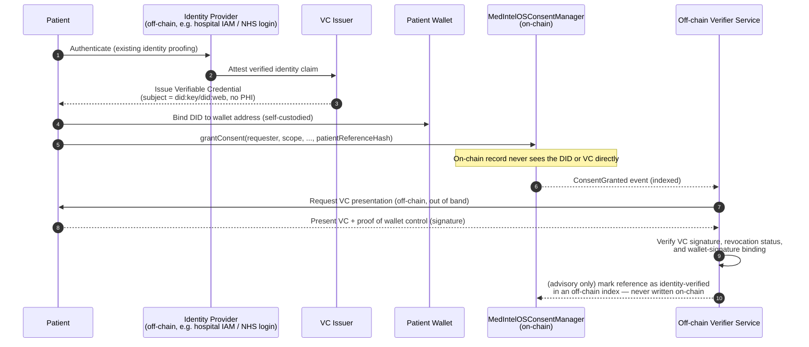

# DID/VC Identity-to-Consent Linkage — Design (Off-Chain)

Status: **design document only**. Nothing described here is implemented in
`contracts/` or `src/medintelos/` yet. This satisfies the "documented DID/VC
design for identity-to-consent linkage, kept off-chain" line item in
[docs/ROADMAP.md](ROADMAP.md) milestone 0.8.0. Implementing it is future work
and would need its own milestone, threat-model update, and audit.

## Problem

`MedIntelOSConsentManager` (see [contracts/MedIntelOSConsent.sol](../contracts/MedIntelOSConsent.sol))
identifies patients and institutions by wallet address (`address`). A wallet
address is not a legal identity, is not proof of who controls it at a given
time, and must never be linked on-chain to PHI or a real-world identifier —
see [docs/THREAT_MODEL.md](THREAT_MODEL.md). The contract already stores only
a `patientReferenceHash` (a salted off-chain reference), never a name or MRN.

The open question this document addresses: **how does a wallet address get
tied to a real, verified patient or institution identity, without putting
identity data on-chain?**

## Design: DIDs + Verifiable Credentials, resolved off-chain

Key points:

- **DIDs and VCs never touch the chain.** The on-chain contract keeps using
  `patientReferenceHash` exactly as it does today. A DID document and any VC
  are resolved and verified entirely off-chain by a verifier service that the
  deployment operates and controls.
- **The link between a wallet address and a DID is off-chain state**, held by
  the operator (e.g. in the same system that manages `patientReferenceHash`
  salts). It is deliberately not a public, on-chain mapping, to avoid
  creating a permanent, linkable identity graph.
- **Method-agnostic**: `did:web` fits institutions (resolvable from the
  `fhirBaseUrl` domain already stored in `InstitutionProfile`); `did:key` or
  a wallet-native method fits patients who should not depend on a hosted
  resolver.
- **Revocation**: VC revocation (e.g. via a status list) is checked by the
  off-chain verifier at presentation time, not encoded on-chain. On-chain
  consent revocation (`revokeConsent`) remains a separate, already-implemented
  mechanism and is not gated on VC status — a patient must always be able to
  revoke consent even if their credential has an unrelated status problem.

## What this explicitly does not do

- It does not make wallet compromise equivalent to identity compromise
  protection — key custody is still the patient's or their proxy's
  responsibility, as already stated in the contract's top-level comment.
- It does not give the on-chain contract any way to independently verify a
  DID/VC claim; the contract has no oracle for this by design, to keep PHI
  and identity-proofing data off-chain.
- It does not replace `docs/GOVERNANCE.md` or `docs/CONTRACT_AUDIT_CHECKLIST.md`.

## Before implementation

1. Pick concrete DID methods to support (recommend starting with `did:web`
   for institutions only, since patient-side key management is the harder,
   higher-risk problem and deserves its own design pass).
2. Decide which VC data model / proof format (e.g. W3C VC Data Model 2.0 with
   JSON-LD or JWT proofs) and get a security review of the verifier service
   before any pilot.
3. Open a tracked issue per `docs/ROADMAP.md` conventions before writing
   implementation code, so the work is reviewable in small units.
